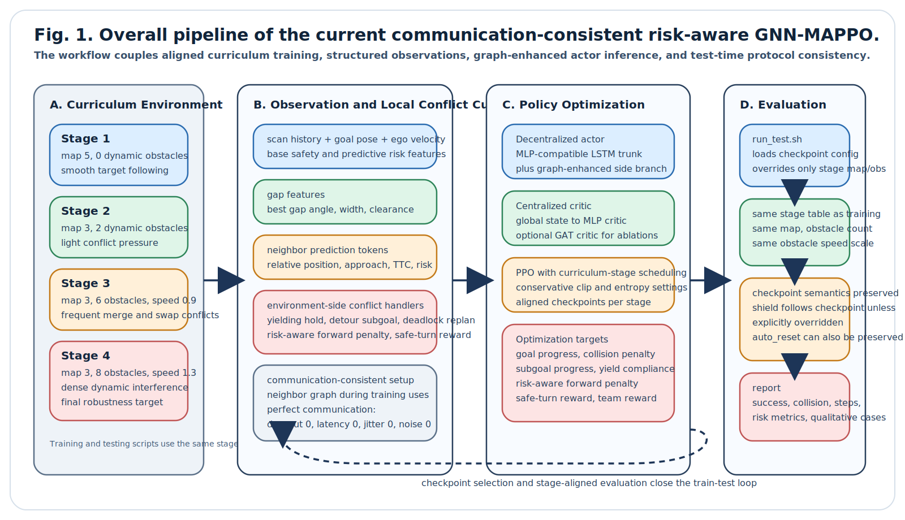
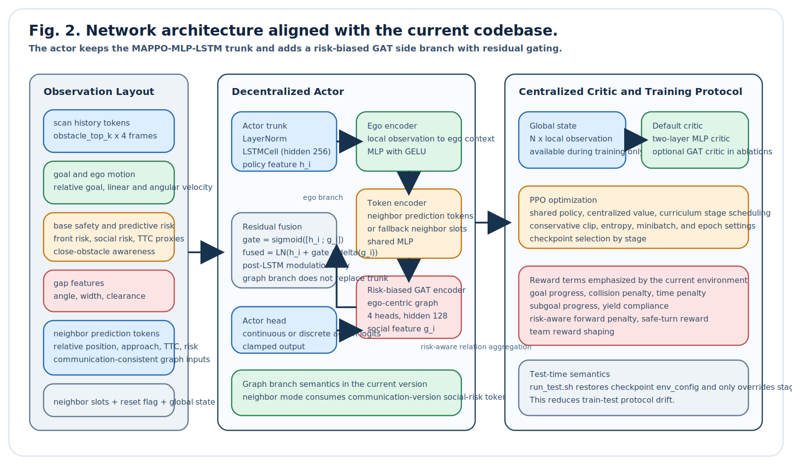
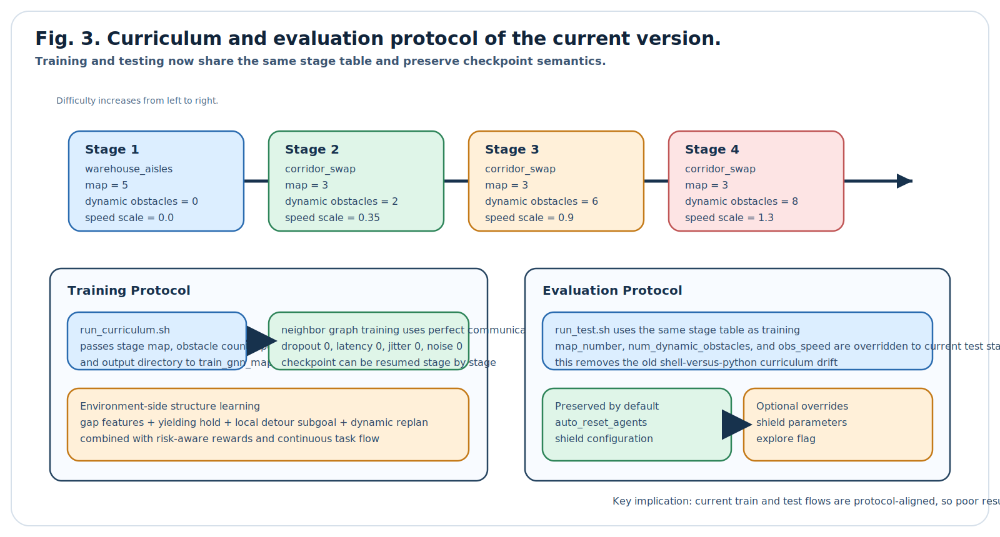
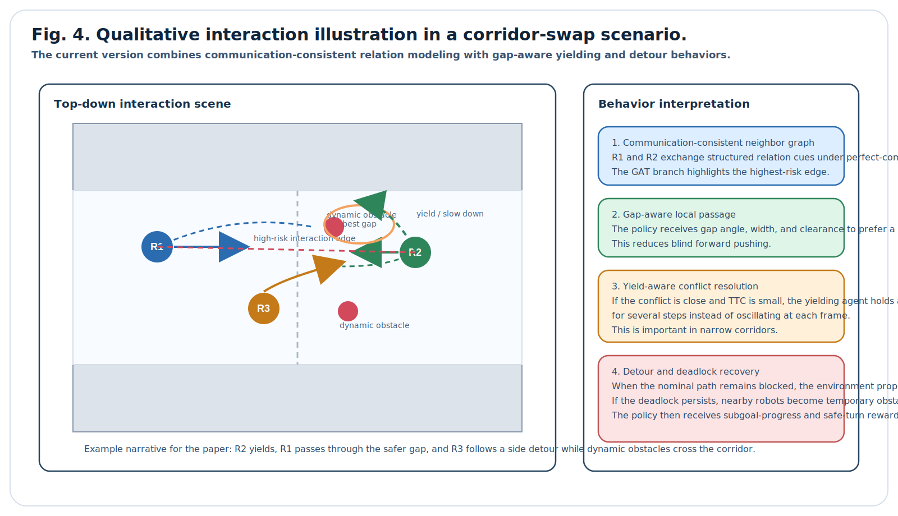

# 面向动态多机器人导航的通信一致风险感知 GNN-MAPPO：结合让行引导与局部绕行的图增强策略

注：本文档为针对当前代码版本整理的中文论文初稿。它不沿用旧版“无需显式通信 social-risk GAT”的主叙事，而是严格对应当前实现中的三条主线：`neighbor` 图分支、训练期完美通信、以及环境侧的 gap/yield/subgoal/dynamic-replan 冲突化解机制。数值结果、图表编号和参考文献可在后续实验完成后补齐。

## 摘要

动态多机器人导航需要在局部观测、强交互和动态障碍共同存在的条件下，同时兼顾到达效率、碰撞安全和拥堵场景下的协同通过能力。传统 ORCA 类解析式方法具有可解释性和实时性优势，但对复杂动态语义、长期任务回报和历史依赖的表达能力有限。多智能体强化学习方法虽然具有更强的策略表达能力，但当图神经网络既承担局部场景理解、又承担邻居交互建模、还要同时吸收通信噪声时，训练常出现高熵、低收益和泛化不稳定的问题。针对这一问题，本文提出一种通信一致风险感知 GNN-MAPPO 框架。该框架保留与 MAPPO-MLP-LSTM 基线一致的局部导航主干，用 LSTM 稳定建模时序局部决策；同时引入轻量图增强分支，对通信版 social-risk token 进行图注意力聚合，并通过风险偏置注意力和残差门控在后置层调制策略表示。进一步地，本文在环境侧加入最佳通行缝隙特征、基于优先权的让行保持机制、局部 detour subgoal 与死锁触发动态重规划，并配套构建与测试脚本一致的四阶段课程训练协议。该方法的核心目标不是让图分支接管导航，而是在保持主干稳定的前提下显式增强高风险交互决策。本文给出与当前实现一致的训练流程、实验设计和图表模板，为后续形成可投稿版本提供统一底稿。

关键词：多机器人导航，MAPPO，图注意力网络，风险感知通信，课程学习，让行机制，局部绕行

## 1. 引言

多机器人在共享空间中的协同导航是仓储物流、园区配送、服务机器人和无人移动平台的重要基础能力。与单机器人导航相比，多机器人系统不仅需要完成静态障碍规避和目标跟踪，还必须在局部观测条件下处理会车、汇入、交叉、动态障碍干扰和窄通道争抢等高耦合交互问题。尤其在狭窄走廊和动态障碍密集场景中，系统是否能够在不碰撞的前提下高效协商通行，往往决定了算法是否具备工程落地价值。

传统 ORCA、RVO 等解析式方法通过相对位置、相对速度和碰撞时间等几何量求解局部安全速度，具有无需训练、可解释性强和推理高效的优点。然而，解析式方法主要优化局部几何可行性，难以显式吸收复杂场景语义、历史状态和长期任务收益，因此在动态扰动、局部最优和高密度拥堵场景中容易出现过保守或行为震荡。

多智能体强化学习，尤其是 MAPPO，由于采用集中训练、分散执行范式，在多机器人协同任务中表现出较好的工程稳定性。但标准 MLP 或 RNN 结构并不擅长显式建模机器人之间的关系拓扑。为此，图神经网络和图注意力网络被广泛引入多智能体控制。然而，如果图分支同时承担局部障碍理解、邻居关系聚合和通信噪声鲁棒性，训练目标会明显耦合，造成策略学习不稳定，且性能收益难以归因。

当前版本代码的设计思路是将问题拆开：局部导航主干继续由稳定的 MLP-LSTM 路径负责，而图分支聚焦于“高风险邻居关系增强”。与旧版工作相比，当前版本有三个本质变化。第一，`neighbor` 图训练不再在 Stage 1 强制全丢包，而是采用训练期完美通信，使策略真正学习到 communication-consistent 的邻居交互模式。第二，环境观测显式加入 gap feature、neighbor prediction token 与 obstacle motion token，使策略能够感知“哪里可以过”和“谁会撞上来”。第三，环境内部增加让行保持、局部绕行和动态重规划机制，使强化学习不再只依赖单一终端回报，而是获得针对冲突通行的结构化训练信号。

基于上述观察，本文面向当前实现提出统一的论文叙事：图网络不接管导航，而是在稳定主干之上，对通信一致的高风险邻居关系进行结构化增强；环境侧则提供围绕 gap、yield 和 deadlock replan 的可学习局部通行先验。本文的贡献概括如下。

1. 提出一种通信一致风险感知 GNN-MAPPO 框架，在保持 MAPPO-MLP-LSTM 主干稳定的同时，以图分支增强多机器人高风险交互决策。
2. 设计一种面向当前实现的通信版 social-risk token 图构建方式，将邻居相对位置、速度、距离和风险偏置统一纳入图注意力编码，并采用后置残差门控抑制图分支对主干的破坏。
3. 将最佳缝隙特征、优先权让行、局部 detour subgoal 和死锁触发动态重规划集成到环境与奖励函数中，形成围绕冲突通行的结构化训练机制。
4. 构建与当前代码完全一致的四阶段课程训练与测试流程，显式对齐训练脚本、测试脚本和环境参数，为后续论文实验和复现提供统一协议。

## 2. 相关工作

### 2.1 解析式多机器人避碰

ORCA 和 RVO 是分布式多机器人局部避碰的经典方法。它们通过速度障碍和线性约束在共享责任假设下为每个机器人求解可行速度，具有很强的几何解释性和实时性。本文并不否定其价值，而是将其中关于相对位置、闭合速度和碰撞时间的风险建模思想，转化为学习式策略中的结构化先验。

### 2.2 基于强化学习的多机器人导航

深度强化学习已被广泛用于局部导航和多智能体协同。MAPPO 因其训练稳定性和 CTDE 结构的清晰性，成为多智能体导航中的强基线。然而，单纯的 MLP/RNN 结构对交互拓扑的建模能力有限，在交汇、会车和拥堵等场景中，缺乏对关键邻居的显式区分。

### 2.3 图神经网络与多智能体关系建模

GNN/GAT 能够通过图结构和注意力机制对多智能体关系进行结构化建模。但在很多工作中，图网络被过度赋权：既要处理局部场景，又要建模邻居关系，还要承担通信噪声鲁棒性。这会拉长训练链条，降低可解释性和复现实用性。本文选择将图分支限制为“关系增强模块”，而不是完整的策略主干。

### 2.4 学习式局部冲突化解

近年来，除了纯策略学习外，一些工作开始引入显式局部规则、交通优先权、局部目标切换和动态重规划，以缓解纯端到端强化学习在窄通道会车中的死锁和高碰撞问题。当前版本代码的让行、gap、detour 和 replan 设计，正是将这类结构化局部机制与 RL 框架结合的具体实现。

## 3. 问题定义

考虑一个包含 $N$ 个差分驱动移动机器人的二维导航环境。环境中同时存在静态障碍与动态障碍，每个机器人在局部观测条件下执行去中心化策略。对于机器人 $i$，局部观测 $o_i^t$ 由以下组成：

1. 多帧局部激光扇区历史；
2. 目标相对位姿；
3. 自身线速度与角速度；
4. 安全相关特征；
5. 短时预测风险特征；
6. 最佳通行缝隙特征；
7. 邻居预测 token；
8. 障碍运动特征；
9. 邻居槽位观测。

训练时，critic 可访问全局状态 $s^t$；执行时，actor 仅依赖本地观测。本文的目标是在保证低碰撞和低死锁的前提下，提高多机器人在动态场景中的到达效率与通过能力。

## 4. 方法

### 4.1 总体框架

本文方法由三部分组成：

1. 去中心化局部导航主干。该主干与 MAPPO-MLP-LSTM 基线保持一致，以 `LayerNorm + LSTMCell + Actor Head` 处理局部观测和邻居槽位。
2. 风险感知图增强分支。图分支从局部观测中切出通信版 social-risk token，经共享编码器和 GAT 聚合得到社交嵌入。
3. 环境侧局部冲突化解机制。环境基于 gap、yield、subgoal detour 和 dynamic replan 提供更强的冲突通行结构信号。

图 1 给出了整体训练与测试流程，图 2 展示了 actor-critic 的细粒度结构。

### 4.2 局部导航主干

当前实现的 actor 主干与 MLP 基线严格对齐。观测先被拆分为局部基础观测和邻居槽位观测，二者拼接后输入 LSTMCell，得到策略特征 $h_i$。该主干负责处理目标跟踪、静态避障和基本时序记忆。保留这一结构的目的有两点：一是稳定训练；二是让图分支带来的性能变化具有可解释性。

### 4.3 通信一致的图分支

与旧版“Stage 1 全丢包”的 neighbor 图不同，当前版本在训练期固定采用完美通信，即零丢包、零延迟、零抖动和零噪声。这样做的理由不是追求理想化假设本身，而是先让图分支学会“如果邻居信息可靠，应该如何使用它”。在当前实现中，训练环境参数固定为：

- `comm_dropout_prob = 0.0`
- `comm_latency_steps = 0`
- `comm_jitter_steps = 0`
- `comm_noise_std = 0.0`

图分支的输入并非原始所有邻居状态，而是从局部观测中切出的高风险 token。每个 token 可包含相对位置、接近速度、归一化风险等语义。随后，ego context 与若干 token 共同构成一个 ego-centric graph。图分支通过风险偏置注意力将高风险邻居赋予更高的聚合权重。

### 4.4 风险偏置图注意力

设 ego 上下文为 $e_i$，第 $k$ 个邻居 token 为 $z_{ik}$。图节点编码后形成 $[e_i, z_{i1}, \dots, z_{iK}]$。图中仅保留 ego 与各邻居节点之间的连接以及自环。对每条边，引入由距离风险、接近速度和 TTC 风险构成的偏置项 $b_{ik}$，其作用是在注意力层中对高风险邻居进行放大：

$$
\alpha_{ik} = \text{softmax}_k \left( \frac{q_i^\top k_{ik}}{\sqrt{d}} + \lambda b_{ik} \right),
$$

其中 $\lambda$ 为风险偏置尺度。该设计使图分支不只是“知道谁在附近”，而是优先关注“谁更危险”。

### 4.5 后置残差门控融合

设 LSTM 主干特征为 $h_i$，图分支特征为 $g_i$。当前实现采用后置残差门控：

$$
\tilde{h}_i = \text{LN}\left(h_i + \sigma(W[h_i; g_i]) \odot \Delta(g_i)\right),
$$

其中 $\sigma(\cdot)$ 为门控函数，$\Delta(\cdot)$ 为图分支投影。该结构具有两个性质：第一，当图分支尚未学稳时，门控可自动抑制其影响；第二，当高风险邻居交互发生时，图分支可以作为“局部修正器”调节策略，而不接管整个导航行为。

### 4.6 Gap-aware 与 Yield-aware 局部冲突机制

当前版本环境不再只依赖通用 progress reward，而是对冲突通行场景提供显式结构先验：

1. 最佳 gap 特征。环境从局部扇区距离中提取最佳通行缝隙的角度、宽度和净空量，作为策略观测的一部分。
2. 让行保持机制。当系统识别到近距离对向冲突时，根据优先权关系和 TTC 触发让行，并在若干步内保持决策，减少来回试探。
3. 局部 detour subgoal。当正前方受阻时，环境会为机器人生成短时绕行子目标，引导机器人从侧向 gap 通行。
4. 死锁触发动态重规划。当检测到连续低速堵塞时，环境将邻居视为临时障碍，对局部路径进行重规划。

这些机制共同形成“可学习但不完全盲目”的局部通行训练信号，使策略更容易学到会车和避让行为。

### 4.7 奖励设计

当前版本奖励函数在标准到达奖励、碰撞惩罚和时间惩罚之外，引入了与局部冲突通行相关的附加项，包括：

1. subgoal progress reward：奖励机器人在绕行或让行阶段接近局部子目标；
2. yield compliance reward：鼓励应让行的机器人降低前冲倾向；
3. risk-aware forward penalty：在高风险时继续前冲会受到惩罚；
4. safe turn reward：高风险时向安全 gap 转向可获得奖励。

这些奖励项并不替代全局任务目标，而是对“如何安全通过”提供更密集的局部反馈。

### 4.8 Critic 与 CTDE 训练

本文默认采用集中式 MLP critic，而不是更复杂的 GAT critic。原因很直接：当前工作的改进焦点是 actor 如何利用风险感知图增强，而不是通过 critic 复杂化获得额外收益。训练时 critic 访问全局状态，执行时 actor 仍保持分散执行。该设计保证部署路径清晰。

### 4.9 四阶段课程学习

当前版本的课程协议如下：

| Stage | Map | Dynamic Obstacles | Speed Scale | Goal |
|---|---|---:|---:|---|
| 1 | warehouse_aisles (map 5) | 0 | 0.0 | 学会稳定前进与基本避障 |
| 2 | corridor_swap (map 3) | 2 | 0.35 | 引入轻量交互与动态障碍 |
| 3 | corridor_swap (map 3) | 6 | 0.9 | 增强会车与汇入冲突 |
| 4 | corridor_swap (map 3) | 8 | 1.3 | 最终高强度动态场景 |

与旧版相比，当前实现已经将 `run_curriculum.sh`、`train_gnn_mappo_full.py` 和 `run_test.sh` 的阶段配置重新对齐，因此课程训练与测试评测使用同一套环境难度定义。

## 5. 实验设计

### 5.1 对比方法

建议至少包含以下方法：

1. `MAPPO-MLP-LSTM`：稳定基线；
2. `Neighbor GNN-MAPPO (ours)`：当前版本方法；
3. `Neighbor GNN-MAPPO w/o gap-yield-replan`：去除环境侧局部机制后的消融；
4. `ORCA`：解析式对比基线。

如果资源允许，可补充：

5. `Neighbor GNN-MAPPO + GAT critic`：验证 critic 复杂化是否值得；
6. `4.20 legacy communication GAT`：与旧训练逻辑做纵向比较。

### 5.2 评价指标

建议报告以下指标：

1. 成功率；
2. 碰撞率；
3. 平均完成步数；
4. 死锁率；
5. 最小机器人间距；
6. 平均社交风险与前向风险；
7. 平均累计回报；
8. 单步推理时延和参数量。

### 5.3 主实验

主实验建议在 Stage 1-4 全部评估，并使用相同测试协议：

- 每个方法至少 3 个随机种子；
- 每个 seed 在每个 stage 下测试 20-50 个 episode；
- 默认保持 checkpoint 中的 `auto_reset_agents` 与通信配置；
- 额外报告 `explore=False` 与 `explore=True` 的差异，分析确定性测试对多机器人僵持的影响。

### 5.4 消融实验

建议按如下层次展开：

1. 去掉图分支：验证图关系增强的净收益；
2. 去掉 residual gate：验证后置门控的重要性；
3. 去掉 gap feature：验证缝隙感知是否提升会车通过率；
4. 去掉 yielding：验证让行保持机制是否减少双向僵持；
5. 去掉 dynamic replan：验证死锁恢复能力的来源。

### 5.5 训练稳定性实验

训练稳定性实验的关注点不是只看 reward 曲线，而应同时看：

1. episode reward；
2. collision count；
3. entropy；
4. social risk / front risk；
5. Stage 切换前后的性能衰减。

其中，当前版本与旧版的重要对比应强调：训练期完美通信、统一课程表和测试脚本对齐后，训练-测试语义偏差被显著减小。

## 6. 结果表与图表占位

### 表 1 主结果表占位

| Method | Stage 1 SR | Stage 2 SR | Stage 3 SR | Stage 4 SR | Collision Rate | Avg. Steps |
|---|---:|---:|---:|---:|---:|---:|
| MAPPO-MLP-LSTM | [待填] | [待填] | [待填] | [待填] | [待填] | [待填] |
| ORCA | [待填] | [待填] | [待填] | [待填] | [待填] | [待填] |
| Ours | [待填] | [待填] | [待填] | [待填] | [待填] | [待填] |

### 表 2 消融实验占位

| Variant | Success Rate | Collision Rate | Deadlock Rate | Avg. Min Dist |
|---|---:|---:|---:|---:|
| Full model | [待填] | [待填] | [待填] | [待填] |
| w/o graph branch | [待填] | [待填] | [待填] | [待填] |
| w/o gap feature | [待填] | [待填] | [待填] | [待填] |
| w/o yielding | [待填] | [待填] | [待填] | [待填] |
| w/o replan | [待填] | [待填] | [待填] | [待填] |

### 图表建议

1. 训练曲线：reward、collision、entropy；
2. 典型走廊会车案例：ours vs baseline；
3. 局部通行行为可视化：yield、gap_detour、replan 三类模式；
4. 风险偏置注意力热图。

## 7. 讨论

当前版本相对于旧版草稿，有两点理论叙事需要特别谨慎。

第一，本文不应再写成“完全不依赖显式通信”。原因是当前版本的 `neighbor` 训练明确使用通信一致设定，图分支语义已经从“无通信 social-risk token”切换到“通信版 social-risk token + 邻居交互增强”。因此更准确的表述应是：我们通过完美通信训练，先学习可靠邻居交互下的结构化关系增强，再在测试与部署中尽量保持环境语义一致。

第二，环境中的 gap/yield/subgoal/replan 机制意味着当前方法不是纯粹的“黑盒端到端 RL”。这并不是缺点，反而是本文的重要工程价值：在多机器人窄通道高冲突场景中，完全依赖稀疏终端回报往往难以稳定收敛，而结构化局部机制能显著提高学习效率和行为可控性。

## 8. 结论

本文围绕当前实现提出了一种通信一致风险感知 GNN-MAPPO 框架。该框架以稳定的 MAPPO-MLP-LSTM 主干为基础，通过风险偏置 GAT 分支增强高风险邻居关系建模，并结合 gap-aware、yield-aware、subgoal detour 和 deadlock-triggered dynamic replan 等环境侧机制，提升多机器人在动态场景中的通行能力。与旧版工作相比，当前版本更加注重训练与测试流程一致性、通信语义一致性和局部冲突化解能力。后续工作将基于本文初稿补齐定量实验、统计显著性分析和英文稿件，形成可投稿版本。

## 附录：写作与作图建议

1. 英文标题可使用：`Communication-Consistent Risk-Aware GNN-MAPPO for Dynamic Multi-Robot Navigation with Yielding-Guided Local Conflict Resolution`。
2. 若目标期刊为 TIV，正文图建议保留 4 张核心图：
   - 图 1 总体流程；
   - 图 2 网络结构；
   - 图 3 课程协议；
   - 图 4 定性案例。
3. 若需要后续转英文稿，可优先翻译摘要、引言末尾贡献和方法第 4 节。
